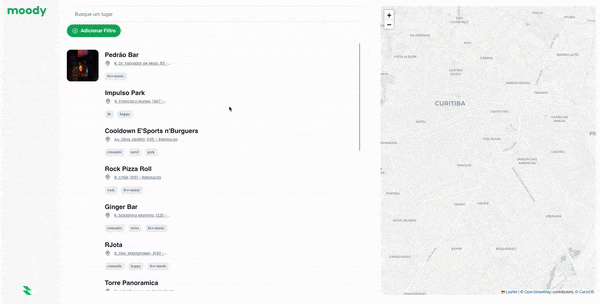

<h1 align="center"></h1>

<p align="center">Find your favorite places</p>

<h4 align="center"> 
	- Status: ✅ -
</h4>


### ☑️ About
---
Moody is a web application designed to enhance your search for places based on your current mood. Developed as a college project, this project utilizes React, PHP, and XAMPP to provide a more accurate and personalized search experience. With Moody, users can easily find suitable places that align with their emotions, creating a unique and tailored exploration journey.

### 🖥️ Overview
---



### 🔌 Running the project
---

To run the project, you need to clone this repository into your XAMPP `htdocs` folder. 
Then, you will need to run the frontend server using the following commands:

```bash
# Download Dependencies
cd ./frontend
npm install

# Run server
npm run dev
```

